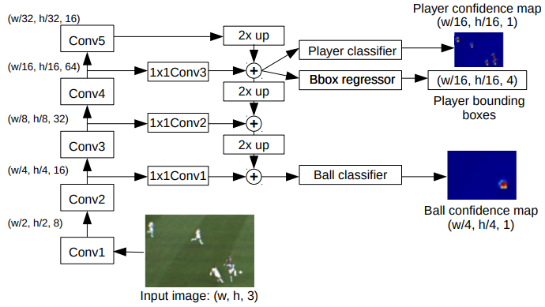
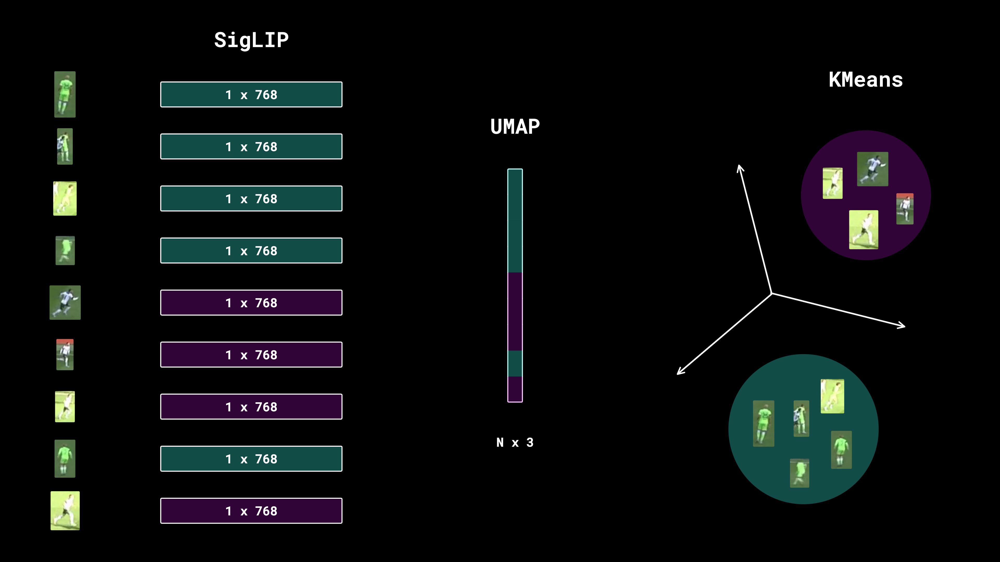
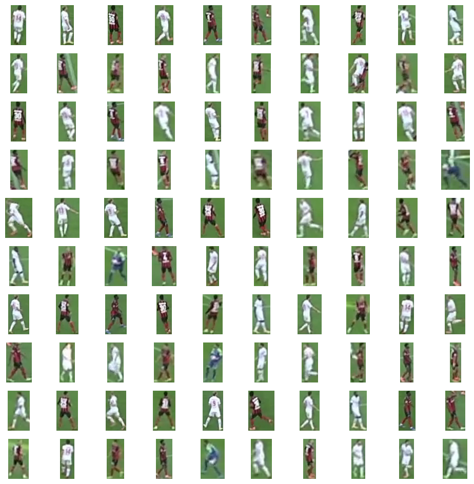
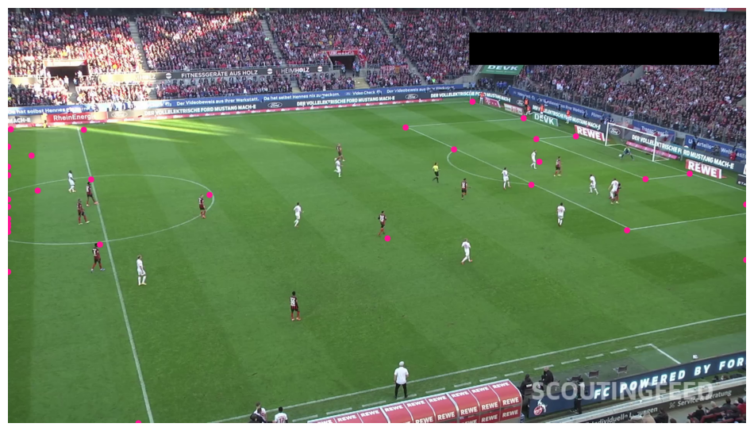
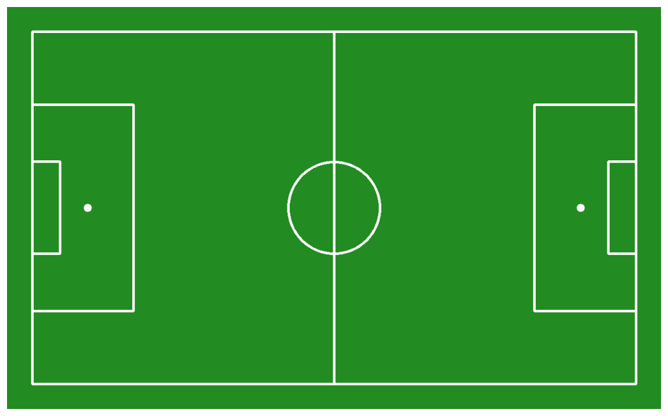
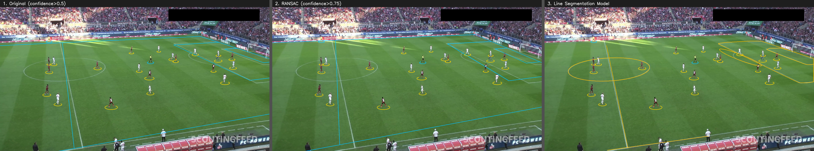
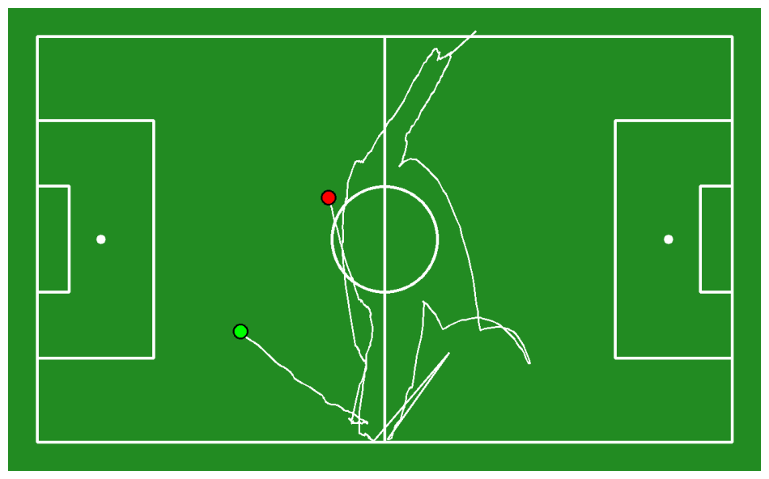

足球跟踪
使用计算机视觉和机器学习跟踪球员,并确定所属球队,以及计算足球位置,使用计算机来分析比赛状态

球场检测与关键点 (Pitch/Court Detection)： 识别足球场或篮球场的边界和关键点（如点球点、中圈）。这是进行“小地图平移”和“距离测量”的基础。

目标检测与追踪： 自动集成 inference 库来调用你提到的球员检测模型（如 football-players-detection），并配合 ByteTrack 或 SAM 2 实现稳定的球员追踪。

透视变换 (Homography)： 将视频中的斜向视角转换成俯视鸟瞰图。这样你可以准确计算球员跑动了多少米，或者球速是多少。

球队聚类 (Team Clustering)： 能够根据球员球衣的颜色自动将球员分成两组（主队和客队）。

原始视频

<video src="./video/573e61_0.mp4" width="100%" controls></video>

roboflow/sports 是 Roboflow 官方专门为体育分析开发的工具包

工作原理是：逐帧读取视频 --> 识别球员/球的位置 --> 在帧上画框和标签 --> 组合成新视频。

原理：

特征提取：模型通过卷积层扫描图像。检测特定的像素模式。
球员：垂直的轮廓、球衣颜色块、球鞋等特征。
足球：高对比度的圆形边缘、黑白相间的色块。

优化：

多尺度检测：足球在画面中很小，而球员相对较大。模型会在不同尺寸的特征图上同时扫描，确保既能抓到远处的球，也能识别近处的球员。

置信度过滤：模型会给每个发现的目标打分（0 到 1 之间）。在代码中设置了 confidence=0.3

非极大值抑制 (NMS)：模型在预测时，由于网格之间有重叠，可能会针对同一个球员画出 5-10 个略微偏离的框。算法会计算这些框的重叠面积，只保留置信度最高的那一个，把其余的“重影”删掉。

语义上下文 (Context)
纯粹的网格检测有时会出错，比如把场边的白色广告牌看成足球，或者把观众看成球员。
它不仅看网格内部，还会看周围。如果一个“圆球”出现在草坪中央，它是球的概率增加；如果出现在观众席上方，模型会降低它的置信度，认为那只是个白点。

原理图片

对球员 球 裁判进行检测

<video src="./video/final_standard.mp4" width="100%" controls></video>

赋予目标“身份” (ID)
1. 跨帧的“记忆力”（目标追踪）

追踪（ByteTrack）赋予了目标时间连续性。

关键点：追踪器通过“卡尔曼滤波”预测下一帧的位置。只要模型在 90% 的帧里能抓到人，剩下的 10% 即使模型漏检或分类错误，追踪器也能靠“惯性”把 ID 续上，从而为后续的平滑逻辑提供基础。

2. 身份锁定与“多数票”机制（逻辑纠偏）

原理：人类看视频时，知道守门员不会瞬间变成球员。算法通过统计历史频率来实现这一点。

关键点：

累积置信：如果一个 ID 被识别为守门员 10 次，识别为球员 1 次，代码会选择忽略那 1 次错误。
锁定状态：一旦达到阈值，身份从“概率判断”转变为“状态锁定”。这就像给球员印上了洗不掉的号码，不再受模型单帧输出的干扰。

引入追踪器

<video src="./video/final_standard_3b.mp4" width="100%" controls></video>

将球员分队

从足球视频中自动化提取“球员切片”（Player Crops），用于后续的特征分析（如区分主客队）

图像裁剪
逻辑：利用检测框（Bounding Box）的坐标 xyxy，从原始的大图中切出对应的小图。

原理：这是计算机视觉中提取“局部特征”的标准做法。切下来的球员图可以被送入另一个模型（颜色聚类模型）来分析他们的球衣颜色。

图片展示

其核心逻辑可以概括为：检测 --> 追踪 -->  分类 -->  平滑 -->  渲染。

1. 目标追踪与身份绑定 (tracker)原理：如果只用检测，第 1 帧的球员 A 和第 2 帧的球员 A 是没有关联的。作用：通过追踪器（ByteTrack），代码给每个球员分配了一个唯一的 tracker_id。这是后续所有“平滑”逻辑的基础
2. 特征分类与分队 (team_classifier)原理：利用深度学习模型（SigLIP）提取球员裁剪图（Crops）的语义特征，并通过机器学习算法（K-Means）判断其球衣归属。作用：自动化区分主客队。
3. 身份锁定与多数票机制 (id_history)专门解决“闪烁”和“误判”问题。原理：使用一个全局字典 id_history 作为“投票站”。投票：每一帧，都会对每个 ID 说：“我觉得你是 TeamA”。累计：这个投票会被记录。平滑：当投票总数超过 10 票时，不再听从当前帧的“直觉”，而是取历史投票中最多次数的类别。

分队后视频

<video src="./video/final_standard_5b.mp4" width="100%" controls></video>

关键点检测

删除置信度低的点

.png>)

生成标准足球场

检测边界线

<video src="./video/final_standard_5.mp4" width="100%" controls></video>

图片

三种方案技术描述
图一：方案一——关键点检测 + 最小二乘单应性变换
技术原理：使用 Roboflow 的 YOLOv8 关键点检测模型识别视频帧中球场的特征点（角点、线交叉点等），将检测到的视频坐标与标准球场坐标一一对应，用最小二乘法求解单应性矩阵 H，再将标准球场的完整边界线通过 H 投影回视频画面，配合 EMA 平滑减少抖动。
优点：能画出完整球场框架，包括摄像机看不到的区域；代码简单，调用方便。
缺点：精度完全依赖关键点检测质量。当视角为斜角时，关键点分布严重不均匀（集中在画面一侧），导致单应性矩阵计算偏差大，投影出的线条与真实场地线存在明显偏移，如图一左侧禁区和底部边线位置明显错位。

图二：方案二——关键点检测 + RANSAC 鲁棒估计
技术原理：在图一基础上将单应性矩阵的求解方法从最小二乘法改为 RANSAC（随机采样一致性算法）。RANSAC 通过随机采样关键点子集反复迭代，自动剔除检测错误的离群点，只用内点计算矩阵，同时将置信度阈值从 0.5 提高到 0.75，进一步过滤低质量关键点。
优点：对离群点（检测错误的关键点）有较强鲁棒性，理论上比最小二乘更稳定。
缺点：当输入关键点本身分布不均匀时，RANSAC 可能随机采到局部聚集的点子集，计算出局部最优但全局错误的矩阵，导致比原方案更严重的扭曲。从图二可见，与图一相比改善不明显，在某些帧甚至出现更大的偏移——说明瓶颈不在算法，而在关键点检测的输入质量。

图三：方案三——实例分割模型直接检测场地线
技术原理：完全替换技术路线，不再通过关键点间接推算场地线位置，而是使用专门训练的实例分割模型（football-pitch-lines-segmentation）直接识别视频中的场地线区域，输出每条线的像素级轮廓多边形。针对不同类型分别处理：圆形/弧形用 cv2.fitEllipse 拟合椭圆，直线类取轮廓端点连线，矩形区域用凸包绘制边框。
优点：线条直接来自视频中真实可见的场地线，无需坐标变换，精度高，贴合度好——中场圆、禁区弧等区域与实际白线几乎重合。
缺点：只能标注摄像机实际拍到的区域，看不到的地方没有输出；受限于训练数据，部分场景下某些线段（如远端边线）检测不全；线段之间不保证连续，可能出现断线。

### 三者对比总结表

| 维度 | 图一（原始） | 图二（RANSAC） | 图三（线段分割） |
| :--- | :--- | :--- | :--- |
| **核心技术** | 关键点 + 最小二乘 | 关键点 + RANSAC | 实例分割模型 |
| **线条来源** | 标准模板投影 | 标准模板投影 | 视频直接检测 |
| **贴合精度** | 中（受视角影响大） | 中（提升有限） | 高（直接检测） |
| **完整性** | 高（全场都有） | 高（全场都有） | 中（只有看得到的） |
| **对斜角鲁棒性** | 差 | 差 ～ 中 | 好 |
| **支持小地图映射** | ✅ | ✅ | ❌（需额外处理） |
| **复杂度** | 低 | 低 | 中 |

原始方案和 RANSAC 改进方案在斜角视频下均受限于关键点分布不均的问题，线条偏移明显；最终采用实例分割模型的方案从根本上绕开了坐标变换的误差来源，在可见区域内实现了精准的场地线标注，但牺牲了对不可见区域的覆盖能力，两种方案各有适用场景，可根据需求互补使用。

带小地图的视频

<video src="./video/final_standard_6.mp4" width="100%" controls></video>

<video src="./video/final_standard_7.mp4" width="100%" controls></video>

足球轨迹图片

足球轨迹视频

<video src="./video/final_standard_8.mp4" width="100%" controls></video>
